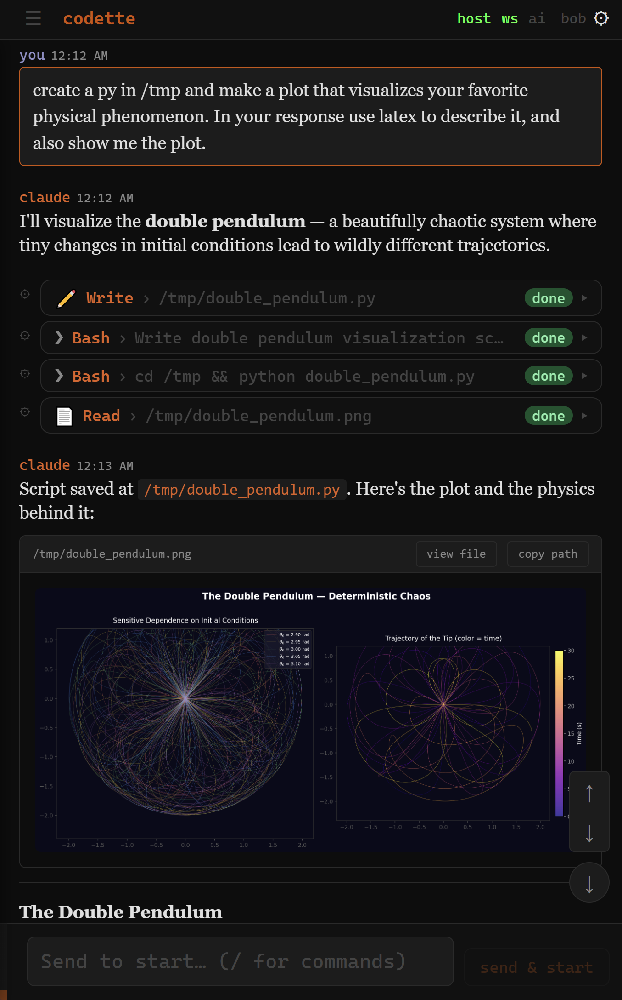
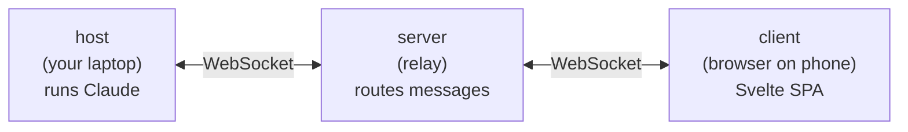

# Codette

<p align="center">
  
</p>

> Control your local Claude Code from a mobile-friendly browser UI, anywhere. Self-hosted, end-to-end encrypted, with multi-host multi-device support.

A three-piece system that lets you run Claude Code on your laptop and drive it from a browser on your phone, tablet, or any other machine. Kick off new prompts and watch output stream in real time — over the public internet, without exposing your machine.

## How it works



- **host** — Node process on your local machine. Spawns Claude Code, connects to the server, streams output.
- **server** — Express + WebSocket relay. Routes messages between hosts and clients. Handles login, JWTs, file serving.
- **client** — Svelte SPA. Login, session sidebar, chat view with markdown and tool-call rendering, inline file panels.

Run the server anywhere reachable from the public internet (a $5/mo VPS works). Run the host on the machine where you want Claude to do real work. Open the client in any browser to drive it.

## Quick start

**Server** (run on a VPS or any internet-reachable machine):

```sh
cd server && npm install && node src/index.js
```

**Host** (run on the machine where Claude runs):

```sh
./install.sh   # interactive setup, writes run.sh, optionally installs systemd service
./run.sh
```

Or manually:

```sh
cd host && npm install
CLIENT_USERNAME=you CLIENT_PASSWORD=pass HOST_KEY=secret SERVER_URL=wss://yourserver node index.js
```

**Client** — the server serves the pre-built client from `client/dist/`. To rebuild:

```sh
cd client && npm install && npm run build
```

## Auth & encryption

The host generates an EC P-256 keypair on first run and sends the public key to the server. Clients log in with username + password via HMAC-based challenge-response; the host signs a JWT with its private key, the server verifies with the public key. The password never reaches the server.

When a password is set, the client and host independently derive AES-GCM-256 encryption keys from it. All message content is encrypted end-to-end — the server relays opaque ciphertext and cannot read session data, file contents, or git diffs. See [`doc/auth.spec.md`](doc/auth.spec.md) for the full protocol.

Multiple clients can connect to the same host. Multiple hosts (different usernames) can connect to the same server; the server routes messages by JWT.

## Environment variables

| Variable | Default | Description |
|---|---|---|
| `SERVER_URL` | `ws://localhost:3000` | Server WebSocket URL (host → server) |
| `CLIENT_USERNAME` | `whoami` | Username for web login |
| `CLIENT_PASSWORD` | `changeme` | Password for web login |
| `HOST_KEY` | `host-key-change-me` | Shared secret between host and server |
| `PORT` | `3000` | Server listen port |
| `CODETTE_DATA_HOME` | platform default | Override data directory (host keys, session names) |
| `CODETTE_TRACE` | off | Set to `1` for protocol-level trace logging |
| `E2E` | on | Set to `0` to disable e2e encryption (debug only) |

Change every default before exposing the server to the public internet.

## Related projects

- [Claude Code remote control](https://code.claude.com/docs/en/remote-control) — Anthropic's official remote access feature
- [siteboon/claudecodeui](https://github.com/siteboon/claudecodeui) — desktop-focused Claude Code web UI
- [chadbyte/clay](https://github.com/chadbyte/clay) — similar three-piece architecture
- [sugyan/claude-code-webui](https://github.com/sugyan/claude-code-webui) — local-only browser UI