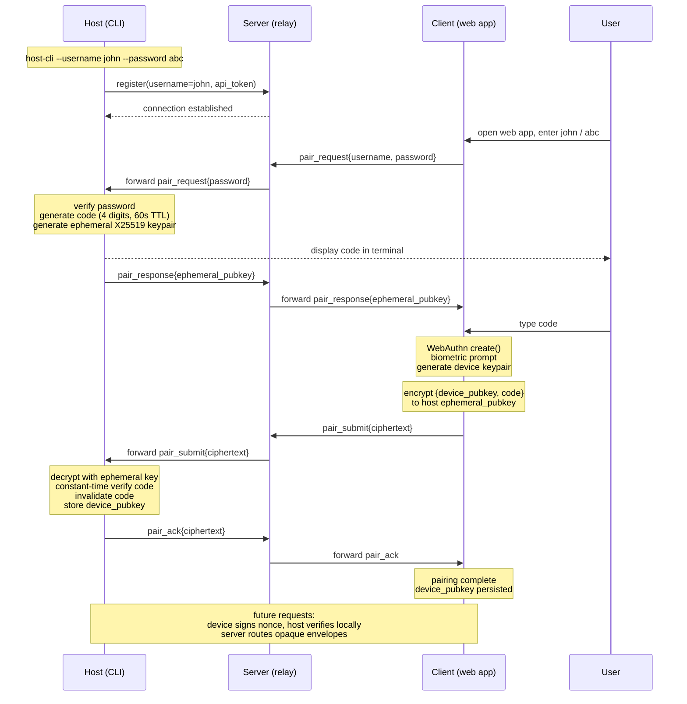

## Authentication via device pairing

Three credentials work in concert.

- **Username** — the routing handle the server uses to find the right host.
- **Password** — a client-to-host shared secret loaded into the host CLI at startup (`host-cli --username john --password abc`); gates whether the host engages a pairing protocol at all and is used only during the pairing window, never as a long-term credential.
- **Pairing code** — a 4-digit value generated fresh per pairing window, displayed in the host's terminal, and typed by the user into the client; the user's eyes are the channel that binds the two endpoints, preventing server impersonation.
- **WebAuthn key** — the long-term per-device credential: a hardware-backed keypair (`Secure Enclave` on iOS, `StrongBox` on Android, `TPM` on Windows) generated by the browser, biometric-gated, with the private key never leaving the device.

Pairing flow: client sends `{username, password, "pair"}` to the server, which routes to the host. Host verifies the password, generates a 4-digit code and an ephemeral X25519 keypair, displays the code in terminal, returns `{ephemeral_pubkey}` to the client. User reads the code and types it into the client. Client runs WebAuthn enrollment (biometric prompt), constructs `{device_pubkey, code}`, encrypts to the host's ephemeral key, and sends opaque ciphertext through the server. Host decrypts, verifies the code (constant-time, single-use, 60s expiry, rate-limited), stores the device's public key in its local authorized-devices list, and acknowledges. Subsequent requests are signed by the device and verified by the host directly; the host issues short-lived session tokens to avoid biometric on every call. Each host independently maintains its authorized-devices list. The server is a dumb relay — no device identities, no auth state, no key material. All users share a single WebAuthn RP ID (your stable domain); credentials are scoped per-user via explicit `allowCredentials` lists at authentication time. The WebAuthn `user.id` handle is stored by the authenticator and returned as `userHandle` in `get()` assertions. Set it to the username bytes (`TextEncoder(username)`) so that discoverable-credential flows (`allowCredentials: []`) can recover the username from `userHandle` without relying on localStorage. Use a random per-user ID instead if the username is sensitive.

## E2E-encrypted sessions (no WebAuthn)

The host holds a persistent EC P-256 keypair stored at `$DATA_DIR/host-key.pem` (mode 0600), generated on first run. On connect the host sends its public key to the server; the server keeps it in memory and uses it to verify all client JWTs. The password never reaches the server.

**Auth flow:** client sends `{username}` to `POST /api/auth/challenge`; the server forwards it to the host as an RPC call. The host generates a random nonce, stores `{nonce, username, ts}` in a short-lived pending map (60 s TTL), and returns `{nonce}` to the client. The client computes `HMAC-SHA256(key=password, data=nonce)` in-browser and posts `{username, nonce, response}` to `POST /api/auth/verify`; the server forwards to the host. The host constant-time-compares the expected HMAC, invalidates the nonce, signs a JWT with its EC private key (`ES256`, 7-day expiry), and returns it. The server passes the token to the client unchanged. Subsequent REST calls and WS connections carry this JWT; the server verifies it with the stored host public key.

**Encryption key:** after login the client derives a symmetric key independently: `PBKDF2(password, "codette-e2e-v1:" + username, 200 000 iters, SHA-256) → AES-GCM-256`. The host derives the same key at startup from its own copies of password and username. The server never sees the password and cannot derive this key.

**Message encryption:** all conversation content is encrypted before leaving either endpoint. The host wraps `claude_line.line`, `session_list` (sessions + hostCwd), and `history.lines[]` in AES-GCM envelopes `{nonce, ciphertext}` (base64) before sending to the server. The client wraps `user.message` the same way. The server routes by the plaintext outer fields (`type`, `sessionId`, routing metadata) and forwards ciphertext opaquely. `agent_event` and `log` are plaintext; they carry only state metadata, no conversation content. `GET /api/sessions` returns the encrypted blob; the client decrypts it with the in-memory key. History responses carry `{nonce, ciphertext, totalLines, incremental}`; the client decrypts to recover `lines[]`. For WS messages, the nonce is a random 96-bit value generated per message.

**File/FS encryption:** this is a closed system (host and client are controlled code; no third-party interop required), so file content responses use a deterministic-nonce construction built entirely from native `crypto.subtle` primitives:

```
K_nonce = HKDF(encKey, "codette-file-nonce-v1", 32)
N       = HMAC-SHA256(K_nonce, A ‖ P)[:12]        // A = AAD, P = plaintext
C‖T     = AES-GCM(encKey, N, P, AAD=A)
```

AAD `A = "file:" ‖ sessionId ‖ ":" ‖ path` binds the ciphertext to its location. The nonce N is deterministic: same content + same AAD → same N → same ciphertext, so HTTP caching works correctly (`ETag: N`). Nonce reuse with different plaintext requires an HMAC-SHA256 96-bit prefix collision (probability ≈ 2⁻⁹⁶ per pair), negligible in practice; AES-GCM's authentication tag T catches any tampering regardless. Wire format: `base64(N ‖ C ‖ T)` — N (12 bytes) is prepended to the GCM output and must travel because the decryptor cannot derive it without first knowing P (circular dependency). This differs from AES-GCM-SIV (RFC 8452), where the tag T *is* the synthetic nonce (T = N_synth), so the decryptor extracts T from the last 16 bytes, uses it as the CTR IV directly, and the nonce travels implicitly as the tag — no extra field. The HMAC construction approximates GCM-SIV's determinism from native primitives at the cost of a 12-byte nonce prefix. Directory listings (`/fs`) use standard AES-GCM with a random nonce since content is volatile and the client-side `inflight` Map handles deduplication. File request *paths* use the same construction on the path string, transmitted as `?enc_path=base64url(C ‖ T)`; the URL is stable for the same path. On key rotation, browser-cached file responses become unreadable (encrypted under the old key); the client retries with `Cache-Control: no-cache` on auth-tag failure — see Limitations.

**Limitations:** the key is tied to the password — a password change requires re-deriving the key. Session history is unaffected: the host holds plaintext and re-encrypts on the next client request. However, file responses cached by the browser (via the deterministic-nonce `ETag` scheme) are encrypted under the old key and become unreadable after rotation; the client detects this via AES-GCM auth-tag failure and retries with `Cache-Control: no-cache`, fetching a fresh response encrypted under the new key — self-healing with one extra round-trip. There are no per-device keys and no device revocation. Forward secrecy and biometric gating require the WebAuthn pairing flow.

## Sharing conversations end-to-end encrypted

Three roles: host runs Claude, server is a relay and opaque blob store, client is the web app. Shares survive host downtime. The host generates a fresh symmetric key K, encrypts the selected message bundle locally, and uploads only ciphertext to the server. The server stores ciphertext indexed by an opaque share-ID and enforces metadata-level policies — expiry, view limits, revocation — without ever reading plaintext. Share URL: `/share/<id>#k=<key>`; browsers never send the fragment to servers. Recipients fetch ciphertext and decrypt in-browser. Hardenings: strict CSP, `Referrer-Policy: no-referrer`, optional password mixed into K via Argon2, default short expiry, post-load fragment scrubbing via `history.replaceState`.

## Pairing flow diagram



Subsequent communication is end-to-end encrypted via the [Noise protocol](https://noiseprotocol.org/) using the established device keypair. The client retains its keypair until the host decides to expire it; at that point the client re-runs WebAuthn (biometric-gated) to generate a new keypair and re-establish the Noise session.
