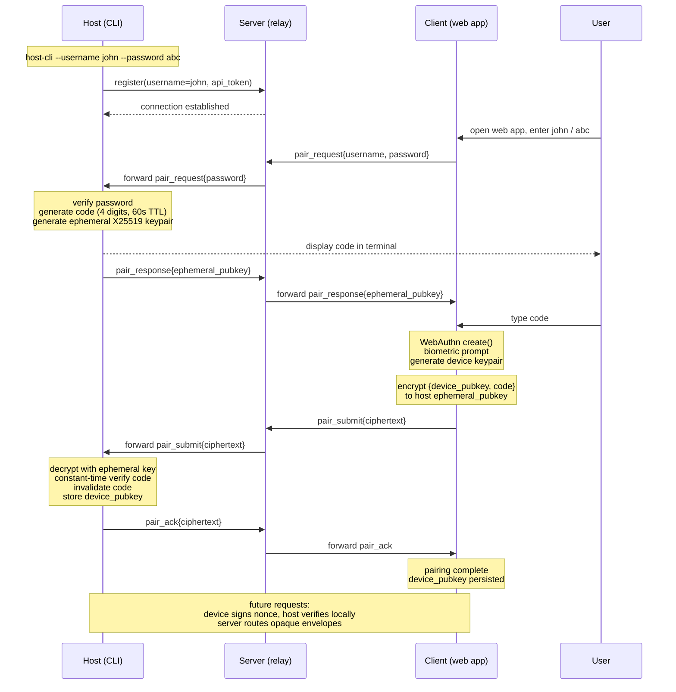

## Authentication via device pairing

Three credentials work in concert.

- **Username** — the routing handle the server uses to find the right host.
- **Password** — a client-to-host shared secret loaded into the host CLI at startup (`host-cli --username john --password abc`); gates whether the host engages a pairing protocol at all and is used only during the pairing window, never as a long-term credential.
- **Pairing code** — a 4-digit value generated fresh per pairing window, displayed in the host's terminal, and typed by the user into the client; the user's eyes are the channel that binds the two endpoints, preventing server impersonation.
- **WebAuthn key** — the long-term per-device credential: a hardware-backed keypair (`Secure Enclave` on iOS, `StrongBox` on Android, `TPM` on Windows) generated by the browser, biometric-gated, with the private key never leaving the device.

Pairing flow: client sends `{username, password, "pair"}` to the server, which routes to the host. Host verifies the password, generates a 4-digit code and an ephemeral X25519 keypair, displays the code in terminal, returns `{ephemeral_pubkey}` to the client. User reads the code and types it into the client. Client runs WebAuthn enrollment (biometric prompt), constructs `{device_pubkey, code}`, encrypts to the host's ephemeral key, and sends opaque ciphertext through the server. Host decrypts, verifies the code (constant-time, single-use, 60s expiry, rate-limited), stores the device's public key in its local authorized-devices list, and acknowledges. Subsequent requests are signed by the device and verified by the host directly; the host issues short-lived session tokens to avoid biometric on every call. Each host independently maintains its authorized-devices list. The server is a dumb relay — no device identities, no auth state, no key material. All users share a single WebAuthn RP ID (your stable domain); credentials are scoped per-user via explicit `allowCredentials` lists at authentication time. The WebAuthn `user.id` handle is stored by the authenticator and returned as `userHandle` in `get()` assertions. Set it to the username bytes (`TextEncoder(username)`) so that discoverable-credential flows (`allowCredentials: []`) can recover the username from `userHandle` without relying on localStorage. Use a random per-user ID instead if the username is sensitive.

## Sharing conversations end-to-end encrypted

Three roles: host runs Claude, server is a relay and opaque blob store, client is the web app. Shares survive host downtime. The host generates a fresh symmetric key K, encrypts the selected message bundle locally, and uploads only ciphertext to the server. The server stores ciphertext indexed by an opaque share-ID and enforces metadata-level policies — expiry, view limits, revocation — without ever reading plaintext. Share URL: `/share/<id>#k=<key>`; browsers never send the fragment to servers. Recipients fetch ciphertext and decrypt in-browser. Hardenings: strict CSP, `Referrer-Policy: no-referrer`, optional password mixed into K via Argon2, default short expiry, post-load fragment scrubbing via `history.replaceState`.

## Pairing flow diagram

Subsequent communication is end-to-end encrypted via the [Noise protocol](https://noiseprotocol.org/) using the established device keypair. The client retains its keypair until the host decides to expire it; at that point the client re-runs WebAuthn (biometric-gated) to generate a new keypair and re-establish the Noise session.
