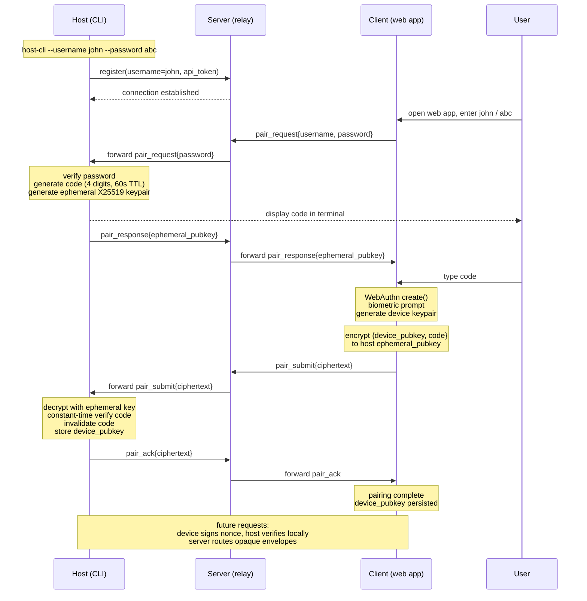

## Host registration

The host CLI owns a long-lived EC P-256 keypair (`host-key.pem`, also used for chat-domain JWT signing). In host enrollment, this keypair IS the host's identity. There are no bearer tokens, no PKCE, no refresh tokens.

Registration binds `(username ↔ jkt, jwk)` after an end-user clears identity verification at one IdP. Configured IdPs surface as buttons on the picker page rendered by `/register/start`. The bound `idp` value is the OIDC `iss` URL verbatim (self: `<serverIssuer>`; any external IdP: that provider's `iss`, e.g. `https://accounts.google.com`).

External IdPs are declared in the repo's `oidc-providers.jsonc` (see "Configuring external OIDC IdPs" below). Adding an IdP needs no code change — it's a new entry in that file plus the IdP's client_id/secret in env.

### Registration (browser-required, one-time per username)

**Pre-IdP (common):**

1. CLI computes the JWK representation of its public key and the RFC 7638 JWK thumbprint (`jkt`).
2. CLI generates a state nonce and signs a `host_proof` JWT:
   `{ iss: jkt, aud: <serverIssuer>/register, username, iat, exp: now+5min, jti }`
3. CLI pre-flight checks username availability at `GET /auth/username-available/:name`.
4. CLI opens browser at `GET /register/start?state=…&username=…&jwk=…&host_proof=…`.
5. Server validates the `host_proof` signature against the supplied JWK, validates the username, generates a per-flow `nonce`, and stores
   `pending[state] = {username, jwk, jkt, nonce, expires: now+5min, ip: req.ip}`.
6. Server renders the picker page: one button per provider loaded from `oidc-providers.jsonc` plus a "Try without an account" trial button. The page sets a CSRF cookie scoped to `/register/finish-trial`.
   - External-IdP buttons are `<a>` to the IdP's pre-built authorize URL.
   - Trial button is `<form method="POST" action="/register/finish-trial">` carrying `state` + `csrf`.

**IdP — trial (self-IdP):**

7t. User clicks "Try without an account." Browser POSTs `state`+`csrf` to `/register/finish-trial`.
8t. Server verifies CSRF, checks claim-limits (both `ip:<req.ip>` and `idp:<serverIssuer>:<jkt>` against `TRIAL_MAX_CLAIMS/TRIAL_WINDOW_MS`), and self-issues an id_token:
    `{ iss: <serverIssuer>, sub: jkt, aud: <serverIssuer>/register/callback, iat, exp: now+5min, jti }`.
9t. Server redirects browser to `/register/callback?state=…&id_token=…`.

**IdP — external OIDC (e.g. Google, GitHub, Microsoft):**

7x. User clicks the IdP's button. Browser navigates to the pre-built authorize URL: `<authorize_url>?response_type=code&client_id=<provider.client_id>&scope=<provider.scope>&redirect_uri=<serverIssuer>/register/callback&state=<state>&nonce=<pending.nonce>` (PKCE-only entries additionally carry `code_challenge=<S256(pending.codeVerifier)>&code_challenge_method=S256`). `authorize_url` and other endpoints came from the IdP's OIDC discovery document fetched at server boot.
8x. User authenticates and consents at the IdP. IdP redirects browser to `/register/callback?state=…&code=…`.
9x. Server exchanges the code at the IdP's token endpoint and receives an id_token. Confidential clients (entry has `client_secret`) authenticate with the secret. Public clients (entry omits `client_secret`) authenticate with the per-flow `code_verifier` instead.

**Post-IdP (common):**

10. `/register/callback` dispatches `verifyIdToken` by `iss`:
    - `iss === <serverIssuer>` → self branch; verifies signature against the server-owned id-token keypair.
    - `iss === <provider.issuer>` for any loaded provider → external branch; verifies signature against the provider's JWKS (fetched at boot from the discovery doc), asserts `aud === provider.client_id`, asserts `nonce === pending[state].nonce`.
    Unknown `iss` is rejected. For all branches `verifyIdToken` checks `requiredClaims: ['exp', 'iat', 'sub']` and returns `{sub, idp, claims}`.
11. Server checks claim-limits keyed by `idp:<idp>:<sub>` against `TRIAL_MAX_CLAIMS/TRIAL_WINDOW_MS`. For self-IdP the `ip:<pending.ip>` counter was already recorded at step 8t; external IdPs bypass the IP counter.
12. Server calls `claimBinding(username, jkt, jwk, {idp, idp_sub: sub})` — atomically writes `username-owners.json`. Renders a "Registered — close this tab" page.
13. CLI polls `GET /register/status?state=…` every 500 ms until status is `"claimed"` or 5-min timeout. On success, writes `credentials.json { server, username, password }` (password is for the chat-domain HMAC browser-auth flow).

**No tokens property:** the host never receives an access_token or refresh_token from the server. Registration only establishes the `(username ↔ jkt)` binding.

`$CODETTE_DATA_DIR/username-owners.json` keeps the binding store: `byName[<username>] = {fp: <jkt>, claimedAt, idp: <iss>, idp_sub: <sub>}` and `byPubkey[<jkt>] = {username, jwk}`. Atomic read-modify-write per claim; `claimBinding` returns `'claimed' | 'name-taken' | 'pubkey-taken'`.

`$CODETTE_DATA_DIR/claim-limits.json` keeps the sliding-window claim ledger: `{"ip:<addr>": [<ts>, …], "idp:<iss>:<sub>": [<ts>, …]}`. Self-IdP claims record both `ip:` and `idp:` keys; external IdPs record only the `idp:` key (the IdP's identity verification is the abuse cost). Cap `TRIAL_MAX_CLAIMS` (default 5), window `TRIAL_WINDOW_MS` (default 15 days). Bare `<ip>` keys from earlier ledger versions get rewritten to `ip:<ip>` on first read.

### Configuring external OIDC IdPs

`oidc-providers.jsonc` (at the repo root) lists the IdPs codette supports. The file ships with every entry commented out; operators uncomment what they want enabled and set the referenced env vars.

```jsonc
{
  "providers": [
    // Google — public sign-in.
    // Enable: uncomment + set GOOGLE_OIDC_CLIENT_ID / _CLIENT_SECRET.
    // {
    //   "issuer":        "https://accounts.google.com",
    //   "client_id":     "${GOOGLE_OIDC_CLIENT_ID}",
    //   "client_secret": "${GOOGLE_OIDC_CLIENT_SECRET}"
    // }
  ]
}
```

**Parsing.** JSONC: line and block comments are stripped before `JSON.parse`. Comment chars inside string values are preserved.

**Env-var interpolation.** Only `${VAR}` syntax (no `$VAR`, no defaults, no nesting). For every `${VAR}` reference in the parsed file, `process.env[VAR]` must be set (empty string counts as set). Any unresolved reference fails-boot with a message listing every missing variable at once.

**Discovery.** For each entry, the server fetches `<issuer>/.well-known/openid-configuration` once at boot to learn `authorization_endpoint`, `token_endpoint`, `jwks_uri`, and `id_token_signing_alg_values_supported`. Discovery failure fails-boot, naming the issuer URL.

**Per-issuer defaults.** A small in-server registry supplies `label`, `brand`, and default `scope` for popular issuer URLs (Google, GitHub, Microsoft, Apple, GitLab). For issuers not in the registry (e.g. corporate Okta or Auth0 tenants), each entry must include `label` and `scope` explicitly; `brand` defaults to `generic`.

**Picker rendering.** Each loaded provider becomes a button with the brand's icon + text (e.g. Google's 4-color G + "Sign in with Google" per Google's Identity branding guidelines). `generic` brand renders a neutral codette-themed button using the entry's `label`.

**Adding an IdP.** Two cases:
- *In the known set* — uncomment the entry in `oidc-providers.jsonc`, set the referenced env vars, restart.
- *Custom (e.g. corporate Okta)* — add an entry with `issuer`, `client_id`, `client_secret`, `label`, `scope`. PR upstream or maintain a deployment fork.

`/register/callback` and `claimBinding` are IdP-agnostic; adding an IdP needs no server code change.

### Connect (every WS connect)

1. CLI signs a fresh handshake JWT: `{ iss: jkt, aud: <server>/host, iat, exp: now+60s, jti }`.
2. CLI opens WS: `wss://server/host?proof=<JWT>&clientUsername=<>`.
3. Server WS handler:
   - Decodes JWT without verifying, extracts `iss` (the `jkt`).
   - Looks up `byPubkey[jkt]` → `{username, jwk}`.
   - Verifies JWT signature against stored JWK.
   - Checks `iat` freshness (within 5 min), `exp` not past, `jti` not seen recently.
   - Checks `iat >= SERVER_START_TIME` (kill-switch: invalidates all handshakes on server restart).
   - Confirms `clientUsername === username` (sanity).
   - Enforces single-host slot: rejects if `hosts.has(username)`.
   - Accepts and places the connection in the hosts map.

**Replay defenses:** jti dedup (in-memory Map with TTL eviction), iat freshness window,
iat-killswitch on server restart.

---

## Authentication via device pairing

Three credentials work in concert.

- **Username** — the routing handle the server uses to find the right host.
- **Password** — a client-to-host shared secret loaded into the host CLI at startup (`host-cli --username john --password abc`); gates whether the host engages a pairing protocol at all and is used only during the pairing window, never as a long-term credential.
- **Pairing code** — a 4-digit value generated fresh per pairing window, displayed in the host's terminal, and typed by the user into the client; the user's eyes are the channel that binds the two endpoints, preventing server impersonation.
- **WebAuthn key** — the long-term per-device credential: a hardware-backed keypair (`Secure Enclave` on iOS, `StrongBox` on Android, `TPM` on Windows) generated by the browser, biometric-gated, with the private key never leaving the device.

Pairing flow: client sends `{username, password, "pair"}` to the server, which routes to the host. Host verifies the password, generates a 4-digit code and an ephemeral X25519 keypair, displays the code in terminal, returns `{ephemeral_pubkey}` to the client. User reads the code and types it into the client. Client runs WebAuthn enrollment (biometric prompt), constructs `{device_pubkey, code}`, encrypts to the host's ephemeral key, and sends opaque ciphertext through the server. Host decrypts, verifies the code (constant-time, single-use, 60s expiry, rate-limited), stores the device's public key in its local authorized-devices list, and acknowledges. Subsequent requests are signed by the device and verified by the host directly; the host issues short-lived session tokens to avoid biometric on every call. Each host independently maintains its authorized-devices list. The server is a dumb relay — no device identities, no auth state, no key material. All users share a single WebAuthn RP ID (your stable domain); credentials are scoped per-user via explicit `allowCredentials` lists at authentication time. The WebAuthn `user.id` handle is stored by the authenticator and returned as `userHandle` in `get()` assertions. Set it to the username bytes (`TextEncoder(username)`) so that discoverable-credential flows (`allowCredentials: []`) can recover the username from `userHandle` without relying on localStorage. Use a random per-user ID instead if the username is sensitive.

## Module boundary: host-enrollment vs user-auth

Two server-side modules with one gate:

- **`server/src/user-auth/`** — human identity surface. Holds one IdP module per configured IdP (self, Google OIDC). `verifyIdToken` is the dispatcher: it routes by the id_token's `iss` to the matching IdP module, which verifies signature, audience, nonce, and required claims, and returns `{sub, idp, claims}`. Owns the picker page, CSRF, the claim-limits ledger.
- **`server/src/host-enrollment/`** — host (CLI/keypair) identity surface. Owns the `byName / byPubkey` binding store, the host_proof on `/register/start`, the WS-handshake proof verification on `/host`. Reads only `{sub, idp}` from the dispatcher's return; treats both as opaque.

Gate: `host-enrollment/register.js` accepts at `/register/callback` either an `id_token` (any IdP that completes in-browser, including self) or a `code` (OIDC code-flow IdPs); for `code` it invokes an injected `exchangeOidcCode(code, redirectUri) → id_token` provided by `user-auth`. The verified `(sub, idp)` flow through `claimBinding` atomically.

Trust direction: the host is the authority for its keypair; the IdP is the authority for the human's identity; the server orchestrates and stores the binding. All three agree before a binding lands.

## E2E-encrypted sessions (no WebAuthn)

The host holds a persistent EC P-256 keypair stored at `$DATA_DIR/host-key.pem` (mode 0600), generated on first run. `$DATA_DIR` defaults to the platform data directory (e.g. `~/.local/share/codette`) and can be overridden via `CODETTE_DATA_HOME`. On connect the host sends its public key to the server; the server keeps it in memory and uses it to verify all client JWTs. The password never reaches the server.

**Auth flow:** client sends `{username}` to `POST /api/auth/challenge`; the server forwards it to the host as an RPC call. The host generates a random nonce, stores `{nonce, username, ts}` in a short-lived pending map (60 s TTL), and returns `{nonce}` to the client. The client computes `HMAC-SHA256(key=password, data=nonce)` in-browser and posts `{username, nonce, response}` to `POST /api/auth/verify`; the server forwards to the host. The host constant-time-compares the expected HMAC, invalidates the nonce, signs a JWT with its EC private key (`ES256`, 7-day expiry), and returns `{token}`. The server passes the response to the client unchanged. Subsequent REST calls and WS connections carry this JWT; the server verifies it with the stored host public key. The client then independently derives encryption keys from the password — no server involvement.

**Encryption is implicit, not negotiated.** Both client and host independently derive encryption keys from the password. If the client has a password, it always encrypts. If the host has a password, it always encrypts. There is no capability negotiation — the server never learns whether e2e is active and cannot influence the decision. This prevents a compromised server from downgrading encryption by stripping capabilities from auth responses or injecting plaintext messages.

The `auth_verify` response contains only `{ token }` — no capabilities field. The client derives keys immediately after login, before any further communication. The host derives keys at startup. Both sides encrypt unconditionally when keys exist.

All clients for the same username share the same password and thus derive the same `encKey`; the host encrypts once and the server broadcasts to all. Plaintext-only clients (no password) cannot connect to a host that encrypts — they would receive encrypted messages they cannot decrypt.

`E2E=0` env var on the host skips key derivation entirely, equivalent to not having a password. For debugging only.

**Encryption keys:** the client derives two keys from the password:
- `encKey`: `PBKDF2(password, "codette-e2e-v1:" + username, 200 000 iters, SHA-256) → AES-GCM-256` — encryption/decryption.
- `nonceKey`: `PBKDF2(password, "codette-e2e-nonce-v1:" + username, 200 000 iters, SHA-256) → HMAC-SHA-256` — deterministic nonce derivation.

The host derives the same pair at startup. The server never sees the password and cannot derive either key.

**Message encryption:** every encrypted message keeps `type` (and routing fields like `sessionId` or RPC `id`) in plaintext; all content fields are encrypted into a single ciphertext blob. When neither side has a password, messages flow as plaintext. When keys exist, both sides encrypt unconditionally. The host enforces presence of `nonce`+`ciphertext` on client-originated sensitive types — `{user, agent_ctl, permission_response, list_sessions, delete_session, set_session_name}` — and drops bare plaintext of those types with a `warn` log. Server-initiated reads (`get_*`, `auth_*`) are allowed plaintext because their outer fields come from REST routing the relay must already see; their responses are still encrypted. `host_status` and `agent_event` are metadata-only and exempt.

**Nonce strategy:**
- WS broadcasts: random 96-bit nonce per message (unchanged).
- RPC request paths: `?enc_path=base64url(nonce ‖ ciphertext)` where `nonce = HMAC-SHA-256(nonceKey, "path:" + path)[:12]`. Deterministic → stable URL → HTTP-cacheable.
- File and directory responses: `nonce = HMAC-SHA-256(nonceKey, content_json)[:12]` — deterministic, HTTP-cacheable via `ETag`. Same content produces same ciphertext; browser `If-None-Match` works.
- Session history, git diffs, set_session_name: random nonce (content volatile or params vary per request).

AES-GCM-SIV is the theoretically correct nonce-misuse-resistant scheme but is blocked by the Web Crypto API (not supported).

Messages fall into two categories:

**Broadcasts** (host→server→all clients; server relays the entire message blindly):
```
claude_line    { type, nonce, ciphertext }        // decrypts to {sessionId, line}
session_list   { type, nonce, ciphertext }        // decrypts to {sessions, hostCwd}
user           { type, sessionId, nonce, ciphertext }  // decrypts to {message[, cwd, codette_settings]}
                                                  // sessionId === '__new__' carries cwd + codette_settings
                                                  // for the spawn path
delete_session { type, sessionId, nonce, ciphertext }  // server-initiated from DELETE /api/sessions/:id;
                                                  // ciphertext encrypts '{}' — presence proves key possession
agent_event    { type, sessionId, event }         // plaintext — metadata only
agent_event    { type, states }                   // plaintext — batch variant
host_status    { type, connected }                // plaintext — server-generated
```

**RPC** (request→response matched by `id`; server routes on `id`, never reads content):
```
get_session_history  req: { id, type, nonce, ciphertext }        // {sessionId, offset, limit}
                     res: { id, result: { nonce, ciphertext } }  // {lines, totalLines}
get_file             req: { id, type, nonce, ciphertext }        // {path}
                     res: { id, result: { nonce, ciphertext } }  // {content}
get_fs               req: { id, type, nonce, ciphertext }        // {path}
                     res: { id, result: { nonce, ciphertext } }  // {entries}
get_git_status       req: { id, type, nonce, ciphertext }        // {cwd}
                     res: { id, result: { nonce, ciphertext } }  // {status}
get_git_log          req: { id, type, nonce, ciphertext }        // {cwd}
                     res: { id, result: { nonce, ciphertext } }  // {log, branch}
get_git_diff         req: { id, type, nonce, ciphertext }        // {cwd, commit}
                     res: { id, result: { nonce, ciphertext } }  // {diff, stat}
get_git_file_diff    req: { id, type, nonce, ciphertext }        // {cwd, path}
                     res: { id, result: { nonce, ciphertext } }  // {diff}
set_session_name     req: { id, type, nonce, ciphertext }        // {sessionId, name}
                     res: { id, result: { ok } }
```

**Never encrypted:** `host_pubkey` (server stores for JWT verify), `auth_challenge`/`auth_verify` (pre-auth, no key yet), `agent_event`/`host_status` (metadata-only).

File/fs/git RPCs take `path` or `cwd` directly — no `sessionId` indirection. The host resolves paths against known session cwds for access control.

### What the server can observe

- Message `type` and `id` (routing)
- `agent_event` state transitions, `host_status`
- Auth fields: `username`, challenge nonce, HMAC response, JWT (no capabilities — e2e is invisible to server)
- Traffic analysis: message count, timing, ciphertext sizes
- It **cannot** observe: session content, file paths, file content, git diffs, session names, cwds, session IDs (encrypted inside ciphertext)

**Limitations:** the key is tied to the password — a password change requires re-deriving the key. Session history is unaffected: the host holds plaintext and re-encrypts on the next client request. However, file responses cached by the browser (via the deterministic-nonce `ETag` scheme) are encrypted under the old key and become unreadable after rotation; the client detects this via AES-GCM auth-tag failure and retries with `Cache-Control: no-cache`, fetching a fresh response encrypted under the new key — self-healing with one extra round-trip. There are no per-device keys and no device revocation. Forward secrecy and biometric gating require the WebAuthn pairing flow.

## Sharing conversations end-to-end encrypted

Three roles: host runs Claude, server is a relay and opaque blob store, client is the web app. Shares survive host downtime. The host generates a fresh symmetric key K, encrypts the selected message bundle locally, and uploads only ciphertext to the server. The server stores ciphertext indexed by an opaque share-ID and enforces metadata-level policies — expiry, view limits, revocation — without ever reading plaintext. Share URL: `/share/<id>#k=<key>`; browsers never send the fragment to servers. Recipients fetch ciphertext and decrypt in-browser. Hardenings: strict CSP, `Referrer-Policy: no-referrer`, optional password mixed into K via Argon2, default short expiry, post-load fragment scrubbing via `history.replaceState`.

## Pairing flow diagram



Subsequent communication is end-to-end encrypted via the [Noise protocol](https://noiseprotocol.org/) using the established device keypair. The client retains its keypair until the host decides to expire it; at that point the client re-runs WebAuthn (biometric-gated) to generate a new keypair and re-establish the Noise session.
