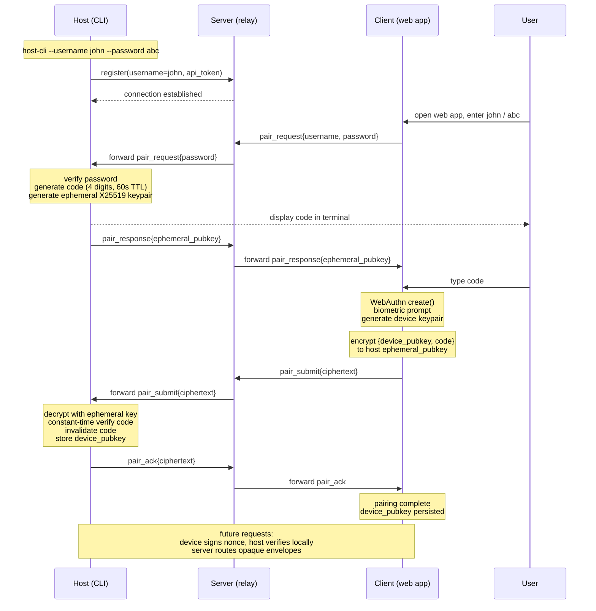

## Host registration via OAuth (CLI login)

The host CLI registers with the server via OAuth 2.0 Authorization Code + PKCE. OAuth gates the CLI's right to connect to `/host` WS and own a host slot at the server (accounting domain). The browser authenticates to the host via the HMAC challenge/verify flow (chat domain, described below) — a separate auth surface.

**Flow:**

1. User runs `curl -fsSL https://your-server/install.sh | sh`. Install script downloads the binary only — no secrets are interpolated. Last line prints `Run:  codette login`.
2. `codette login` prompts the user for a username (the host's authority for what it will be called), pre-flight-checks availability via `GET /auth/username-available/:name` and re-prompts on conflict, then prompts for a chat-domain password. It generates PKCE (`code_verifier` + SHA-256 `code_challenge`) and a random `state`, binds a free local port, and opens the browser at `GET /oauth/auth?response_type=code&client_id=codette-cli&redirect_uri=<server>/auth/success&code_challenge=…&code_challenge_method=S256&scope=openid+offline_access&prompt=consent&login_hint=<username>&state=…`. The `redirect_uri` is always `<server>/auth/success` — the only URI registered with the OAuth provider. The free local port is communicated to the server inside the `state` parameter as a base64url-encoded JSON object (e.g. `{"port":52341,"nonce":"…"}`); this avoids registering per-process localhost URIs with the OAuth server. The CLI requests `scope=openid offline_access` and `prompt=consent` so the server always issues a `refresh_token`. `login_hint` carries the username the host has chosen.
3. The server renders a consent page that displays the username read-only ("Sign in as `<username>`") with a single button: **Try without registration for N days**. (Sign-in-with-Google and similar IdP options are not implemented in v1.) The server validates the username (lowercase letter-led `[a-z0-9_-]{2,32}`, not already claimed) before rendering; an already-claimed name yields a `409` error page. Submitting POSTs `/oauth/interaction/<uid>/trial`.
4. The trial handler validates CSRF + interaction session, checks the per-IP claim limit (5 per 15 days by default), atomically claims `{username → sub}` in the persistent owner mapping at `$OAUTH_DATA_DIR/username-owners.json` (race-safe boundary; pre-flight in step 2 is advisory), mints a one-shot `code` bound to the `code_challenge` and `redirect_uri`, and redirects the browser to an intermediate page `GET /auth/success?code=…`. On `taken` the IP's rate-limit slot is refunded.
5. The `/auth/success` page extracts the local port from the `state` parameter and attempts `fetch('http://localhost:<port>/callback?code=…', { mode: 'no-cors' })`. If the local CLI listener responds, the page updates to "Authenticated" and auto-redirects to `/` (the chat UI) after 3 seconds. If the fetch fails (CLI is running on a remote machine), the page falls back to displaying the code with a copy button so the user can paste it into the CLI prompt; no auto-redirect in that case. The auth code therefore arrives at the CLI via the success page's JS fetch, not via a browser redirect to a localhost URI.
6. The CLI's local listener receives the code (or stdin paste resolves first — both paths race), then POSTs `/oauth/token` with `grant_type=authorization_code`, the `code`, the `code_verifier`, and `redirect_uri=<server>/auth/success`. The server validates PKCE, confirms the `redirect_uri` matches the one used in the authorization request, marks the code consumed, and returns `{access_token, refresh_token, expires_in, token_type}`.
7. The CLI persists `{server, refresh_token, username, password}` in `~/.config/codette/credentials.json` (mode 0600). The host is the authority for its own username; the CLI never re-reads it from the token (the binding lives server-side as a defensive record). The access token's `preferred_username` claim exists solely so the `/host` WS handler can re-validate the binding on connect; the host asserts the username via the existing `?clientUsername=` query parameter, and the server rejects the connection (`1008`) if it does not match the bound name for that token's `sub`. On each subsequent startup the CLI exchanges `refresh_token` for a fresh `access_token`. The `access_token` is the credential the CLI sends as `?token=…` when opening the `/host` WebSocket.

**Lifetime:** issued tokens carry a standard `exp` claim N days from issuance (default 7); the refresh token expires at the same time. After expiry, the refresh-token grant fails; the host process logs the error and exits. Server-side credentials and any slots they own are reaped per the retention policy.

**Rate limiting:** the `/oauth/interaction/<uid>/trial` handler limits successful claims per IP (default 5 / 15 days). The window and count are configurable via env. Failed attempts (bad CSRF, expired code) are not counted against the limit but are independently rate-limited via the existing `authRateLimit` middleware (10 / min).

**Server-resident OAuth implementation:** the OAuth Authorization Server is implemented using [`node-oidc-provider`](https://github.com/panva/node-oidc-provider). The library handles spec compliance for `/oauth/auth` (authorization endpoint), `/oauth/token`, the device flow (unused for now), token signing (ES256 with a server-owned `oauth_keypair`), JWKS publication, refresh, revocation, and code lifecycle. The provider is mounted at `/oauth`; oidc-provider's default path for the authorization endpoint is `/auth`, making the full path `/oauth/auth`. The consent page (single trial button) is the only custom UI; everything else is library-provided.

## Authentication via device pairing

Three credentials work in concert.

- **Username** — the routing handle the server uses to find the right host.
- **Password** — a client-to-host shared secret loaded into the host CLI at startup (`host-cli --username john --password abc`); gates whether the host engages a pairing protocol at all and is used only during the pairing window, never as a long-term credential.
- **Pairing code** — a 4-digit value generated fresh per pairing window, displayed in the host's terminal, and typed by the user into the client; the user's eyes are the channel that binds the two endpoints, preventing server impersonation.
- **WebAuthn key** — the long-term per-device credential: a hardware-backed keypair (`Secure Enclave` on iOS, `StrongBox` on Android, `TPM` on Windows) generated by the browser, biometric-gated, with the private key never leaving the device.

Pairing flow: client sends `{username, password, "pair"}` to the server, which routes to the host. Host verifies the password, generates a 4-digit code and an ephemeral X25519 keypair, displays the code in terminal, returns `{ephemeral_pubkey}` to the client. User reads the code and types it into the client. Client runs WebAuthn enrollment (biometric prompt), constructs `{device_pubkey, code}`, encrypts to the host's ephemeral key, and sends opaque ciphertext through the server. Host decrypts, verifies the code (constant-time, single-use, 60s expiry, rate-limited), stores the device's public key in its local authorized-devices list, and acknowledges. Subsequent requests are signed by the device and verified by the host directly; the host issues short-lived session tokens to avoid biometric on every call. Each host independently maintains its authorized-devices list. The server is a dumb relay — no device identities, no auth state, no key material. All users share a single WebAuthn RP ID (your stable domain); credentials are scoped per-user via explicit `allowCredentials` lists at authentication time. The WebAuthn `user.id` handle is stored by the authenticator and returned as `userHandle` in `get()` assertions. Set it to the username bytes (`TextEncoder(username)`) so that discoverable-credential flows (`allowCredentials: []`) can recover the username from `userHandle` without relying on localStorage. Use a random per-user ID instead if the username is sensitive.

## E2E-encrypted sessions (no WebAuthn)

The host holds a persistent EC P-256 keypair stored at `$DATA_DIR/host-key.pem` (mode 0600), generated on first run. `$DATA_DIR` defaults to the platform data directory (e.g. `~/.local/share/codette`) and can be overridden via `CODETTE_DATA_HOME`. On connect the host sends its public key to the server; the server keeps it in memory and uses it to verify all client JWTs. The password never reaches the server.

**Auth flow:** client sends `{username}` to `POST /api/auth/challenge`; the server forwards it to the host as an RPC call. The host generates a random nonce, stores `{nonce, username, ts}` in a short-lived pending map (60 s TTL), and returns `{nonce}` to the client. The client computes `HMAC-SHA256(key=password, data=nonce)` in-browser and posts `{username, nonce, response}` to `POST /api/auth/verify`; the server forwards to the host. The host constant-time-compares the expected HMAC, invalidates the nonce, signs a JWT with its EC private key (`ES256`, 7-day expiry), and returns `{token}`. The server passes the response to the client unchanged. Subsequent REST calls and WS connections carry this JWT; the server verifies it with the stored host public key. The client then independently derives encryption keys from the password — no server involvement.

**Encryption is implicit, not negotiated.** Both client and host independently derive encryption keys from the password. If the client has a password, it always encrypts. If the host has a password, it always encrypts. There is no capability negotiation — the server never learns whether e2e is active and cannot influence the decision. This prevents a compromised server from downgrading encryption by stripping capabilities from auth responses or injecting plaintext messages.

The `auth_verify` response contains only `{ token }` — no capabilities field. The client derives keys immediately after login, before any further communication. The host derives keys at startup. Both sides encrypt unconditionally when keys exist.

All clients for the same username share the same password and thus derive the same `encKey`; the host encrypts once and the server broadcasts to all. Plaintext-only clients (no password) cannot connect to a host that encrypts — they would receive encrypted messages they cannot decrypt.

`E2E=0` env var on the host skips key derivation entirely, equivalent to not having a password. For debugging only.

**Encryption keys:** the client derives two keys from the password:
- `encKey`: `PBKDF2(password, "codette-e2e-v1:" + username, 200 000 iters, SHA-256) → AES-GCM-256` — encryption/decryption.
- `nonceKey`: `PBKDF2(password, "codette-e2e-nonce-v1:" + username, 200 000 iters, SHA-256) → HMAC-SHA-256` — deterministic nonce derivation.

The host derives the same pair at startup. The server never sees the password and cannot derive either key.

**Message encryption:** every encrypted message keeps `type` (and routing fields like `sessionId` or RPC `id`) in plaintext; all content fields are encrypted into a single ciphertext blob. When neither side has a password, messages flow as plaintext. When keys exist, both sides encrypt unconditionally. The host enforces presence of `nonce`+`ciphertext` on client-originated sensitive types — `{user, agent_ctl, permission_response, list_sessions, delete_session, set_session_name}` — and drops bare plaintext of those types with a `warn` log. Server-initiated reads (`get_*`, `auth_*`) are allowed plaintext because their outer fields come from REST routing the relay must already see; their responses are still encrypted. `host_status` and `agent_event` are metadata-only and exempt.

**Nonce strategy:**
- WS broadcasts: random 96-bit nonce per message (unchanged).
- RPC request paths: `?enc_path=base64url(nonce ‖ ciphertext)` where `nonce = HMAC-SHA-256(nonceKey, "path:" + path)[:12]`. Deterministic → stable URL → HTTP-cacheable.
- File and directory responses: `nonce = HMAC-SHA-256(nonceKey, content_json)[:12]` — deterministic, HTTP-cacheable via `ETag`. Same content produces same ciphertext; browser `If-None-Match` works.
- Session history, git diffs, set_session_name: random nonce (content volatile or params vary per request).

AES-GCM-SIV is the theoretically correct nonce-misuse-resistant scheme but is blocked by the Web Crypto API (not supported).

Messages fall into two categories:

**Broadcasts** (host→server→all clients; server relays the entire message blindly):
```
claude_line    { type, nonce, ciphertext }        // decrypts to {sessionId, line}
session_list   { type, nonce, ciphertext }        // decrypts to {sessions, hostCwd}
user           { type, sessionId, nonce, ciphertext }  // decrypts to {message[, cwd, codette_settings]}
                                                  // sessionId === '__new__' carries cwd + codette_settings
                                                  // for the spawn path
delete_session { type, sessionId, nonce, ciphertext }  // server-initiated from DELETE /api/sessions/:id;
                                                  // ciphertext encrypts '{}' — presence proves key possession
agent_event    { type, sessionId, event }         // plaintext — metadata only
agent_event    { type, states }                   // plaintext — batch variant
host_status    { type, connected }                // plaintext — server-generated
```

**RPC** (request→response matched by `id`; server routes on `id`, never reads content):
```
get_session_history  req: { id, type, nonce, ciphertext }        // {sessionId, offset, limit}
                     res: { id, result: { nonce, ciphertext } }  // {lines, totalLines}
get_file             req: { id, type, nonce, ciphertext }        // {path}
                     res: { id, result: { nonce, ciphertext } }  // {content}
get_fs               req: { id, type, nonce, ciphertext }        // {path}
                     res: { id, result: { nonce, ciphertext } }  // {entries}
get_git_status       req: { id, type, nonce, ciphertext }        // {cwd}
                     res: { id, result: { nonce, ciphertext } }  // {status}
get_git_log          req: { id, type, nonce, ciphertext }        // {cwd}
                     res: { id, result: { nonce, ciphertext } }  // {log, branch}
get_git_diff         req: { id, type, nonce, ciphertext }        // {cwd, commit}
                     res: { id, result: { nonce, ciphertext } }  // {diff, stat}
get_git_file_diff    req: { id, type, nonce, ciphertext }        // {cwd, path}
                     res: { id, result: { nonce, ciphertext } }  // {diff}
set_session_name     req: { id, type, nonce, ciphertext }        // {sessionId, name}
                     res: { id, result: { ok } }
```

**Never encrypted:** `host_pubkey` (server stores for JWT verify), `auth_challenge`/`auth_verify` (pre-auth, no key yet), `agent_event`/`host_status` (metadata-only).

File/fs/git RPCs take `path` or `cwd` directly — no `sessionId` indirection. The host resolves paths against known session cwds for access control.

### What the server can observe

- Message `type` and `id` (routing)
- `agent_event` state transitions, `host_status`
- Auth fields: `username`, challenge nonce, HMAC response, JWT (no capabilities — e2e is invisible to server)
- Traffic analysis: message count, timing, ciphertext sizes
- It **cannot** observe: session content, file paths, file content, git diffs, session names, cwds, session IDs (encrypted inside ciphertext)

**Limitations:** the key is tied to the password — a password change requires re-deriving the key. Session history is unaffected: the host holds plaintext and re-encrypts on the next client request. However, file responses cached by the browser (via the deterministic-nonce `ETag` scheme) are encrypted under the old key and become unreadable after rotation; the client detects this via AES-GCM auth-tag failure and retries with `Cache-Control: no-cache`, fetching a fresh response encrypted under the new key — self-healing with one extra round-trip. There are no per-device keys and no device revocation. Forward secrecy and biometric gating require the WebAuthn pairing flow.

## Sharing conversations end-to-end encrypted

Three roles: host runs Claude, server is a relay and opaque blob store, client is the web app. Shares survive host downtime. The host generates a fresh symmetric key K, encrypts the selected message bundle locally, and uploads only ciphertext to the server. The server stores ciphertext indexed by an opaque share-ID and enforces metadata-level policies — expiry, view limits, revocation — without ever reading plaintext. Share URL: `/share/<id>#k=<key>`; browsers never send the fragment to servers. Recipients fetch ciphertext and decrypt in-browser. Hardenings: strict CSP, `Referrer-Policy: no-referrer`, optional password mixed into K via Argon2, default short expiry, post-load fragment scrubbing via `history.replaceState`.

## Pairing flow diagram



Subsequent communication is end-to-end encrypted via the [Noise protocol](https://noiseprotocol.org/) using the established device keypair. The client retains its keypair until the host decides to expire it; at that point the client re-runs WebAuthn (biometric-gated) to generate a new keypair and re-establish the Noise session.
