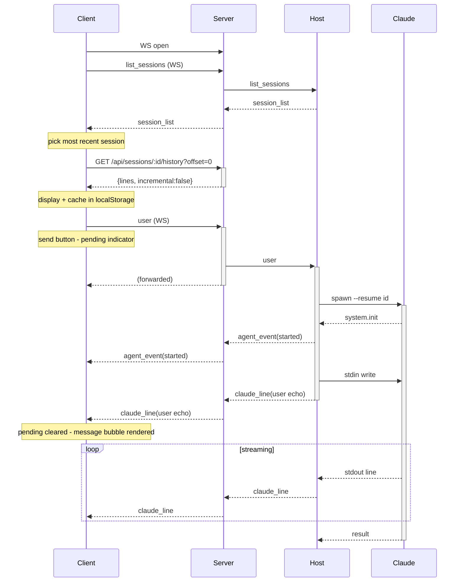
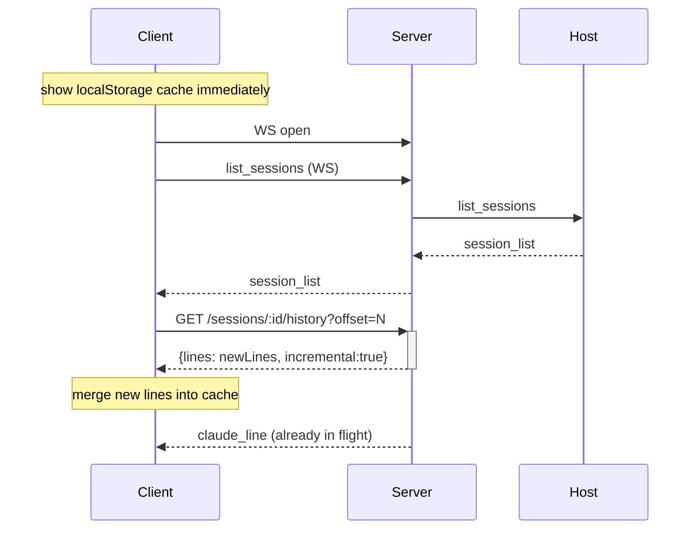
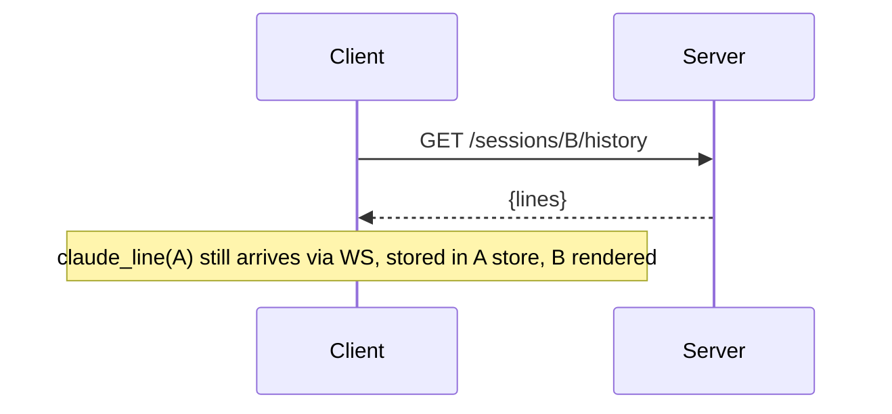
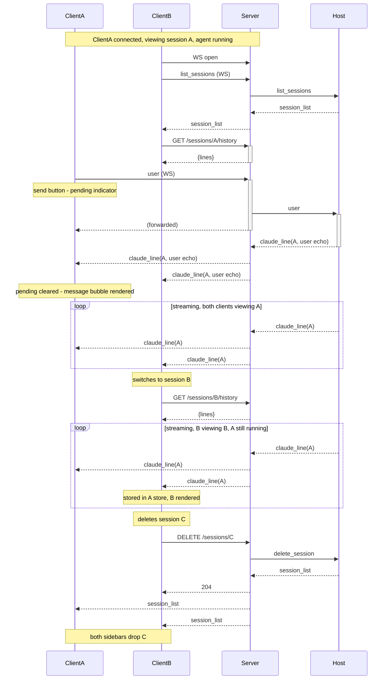
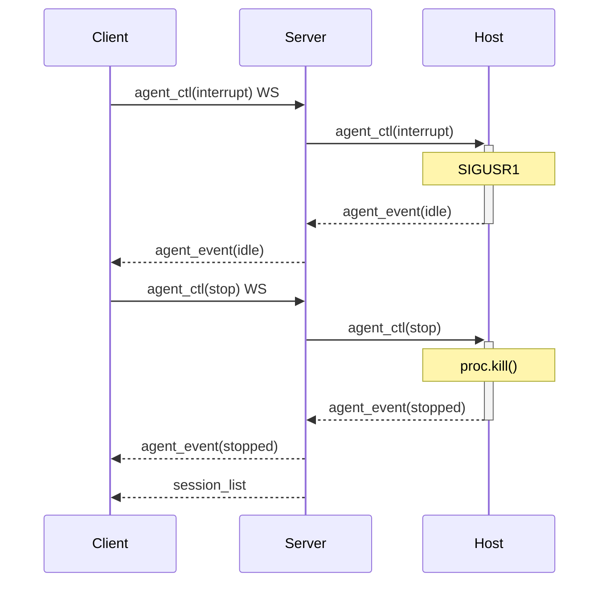

# Protocol Specification

Three-layer protocol. REST for stateless reads/writes, WebSocket for push events and
the stateful host stdin pipe.

```
Claude process  ←stdin/stdout→  Host  ←/host WS→  Server  ←REST+WS→  Clients
```

**Convention:** message fields invented by this app (not part of Claude CLI/Code) are prefixed
`codette_` (e.g. `codette_settings`).

---

## Layer 1 — Claude ↔ Host (stream-json stdio)

Standard Claude CLI stream-json protocol. Full event reference with examples: [`doc/claude-jsonl.md`](doc/claude-jsonl.md). Host spawns claude with:
```
claude --dangerously-skip-permissions \
       --input-format stream-json \
       --output-format stream-json \
       --include-partial-messages \
       --verbose \
       [--resume <sessionId>]
```

### Claude → Host (stdout)

| type | key fields | notes |
|------|-----------|-------|
| `system`    | `subtype:"init"`, `session_id`, `cwd` | first event |
| `assistant` | `message.{id,content}` | streamed; `text` and `tool_use` blocks |
| `tool`      | `message.content[]` (tool_result items) | host forwards to server |
| `user`      | `message.content: ToolResultBlock[]` | tool results only; **initial user message is NOT emitted on stdout** (session file only) |
| `result`    | `subtype`, `total_cost_usd`, `usage` | end of turn |

### Host → Claude (stdin)

| type | key fields |
|------|-----------|
| `user` | `role:"user"`, `content: string` |

---

## Layer 2 — Host ↔ Server (WebSocket `/host?key=HOST_KEY`)

One persistent connection. Host reconnects on drop.

### Host → Server

| type | key fields | notes |
|------|-----------|-------|
| `log` | `level`, `msg`, `data?`, `ts` | server buffers last 500 |
| `claude_line` | `sessionId`, `line` | every stdout line; server broadcasts to all WS clients |
| `agent_event` | `sessionId`, `event` | state transition; server broadcasts and updates agent map |
| `session_list` | `sessions: Session[]`, `hostCwd: string` | response to `list_sessions`; server caches and returns via REST |

**`agent_event` values:** `started` · `streaming` · `idle` · `stopped`

**Session object:**
```json
{ "id": "string", "title": "string", "ts": 1234567890123,
  "msgCount": 12, "cwd": "/path", "agentState": "running"|"idle"|null }
```
`agentState` is added by the server's `enrichSessions()` from the `agents` map; `null` means no agent running.

### Server → Host

| type | key fields | notes |
|------|-----------|-------|
| `list_sessions` | — | on host connect; response populates server's session cache |
| `new_session` | `cwd?: string`, `firstMessage?: string` | spawn fresh claude; if `firstMessage` provided, written to stdin immediately to trigger `system.init` |
| `delete_session` | `sessionId` | delete `.jsonl` file; host sends updated `session_list` |
| `agent_ctl` | `sessionId`, `event: 'stop'\|'interrupt'` | `stop`: kill process · `interrupt`: SIGUSR1 |
| `user` | `sessionId`, `message: {role, content}` | forward to claude stdin; host auto-resumes if no agent running |

---

## Layer 3 — Server ↔ Client

### REST API

JWT in `Authorization: Bearer <token>` header (obtained via challenge/verify flow).

| method | path | body / query | response | notes |
|--------|------|------|----------|-------|
| `POST` | `/api/auth/challenge` | `{username}` | `{nonce}` | no auth; server forwards to host RPC |
| `POST` | `/api/auth/verify` | `{username, nonce, response}` | `{token}` | HMAC-SHA256 response; sets `username` cookie; no capabilities — e2e is implicit from password |
| `GET` | `/api/sessions` | — | `{sessions: Session[], hostCwd: string}` | cached session list from host; clients should prefer WS `list_sessions` for fresh data |
| `GET` | `/api/sessions/:id/history` | `?offset=N` / `?limit=N` / `?offset=N&limit=M` | `{lines: string[], totalLines: number, incremental: bool}` | raw JSONL lines; `?limit=N` → last N lines; `?offset=N&limit=M` → lines [N, N+M); `?offset=N` → lines [N, end). Server dedup key: `sessionId:offset:limit` |
| `POST` | `/api/sessions` | `{cwd?: string, firstMessage?: string}` | 202 | create session; `firstMessage` bootstraps `system.init`; client auto-switches on `agent_event: started` |
| `DELETE` | `/api/sessions/:id` | — | 204 | broadcasts new `session_list` from host  over WS |
| `GET` | `/api/logs` | `?fmt=text` | JSON array or plain text | `x-host-key` auth |
| `GET` | `/*` | — | `index.html` | SPA fallback |

### WebSocket `/ws?token=JWT`

Push events and stateful commands only. No capability negotiation on connect — the client sends `list_sessions` as the first message (encrypted if keys exist).

**Server → Client (all broadcast)**

| type | key fields | notes |
|------|-----------|-------|
| `session_list` | `sessions: Session[]` | any session change; `hostCwd` is REST-only |
| `claude_line` | `sessionId`, `line` | clients route to per-session message store |
| `agent_event` | `sessionId`, `event` | clients update `agentActive` |
| `host_status` | `connected: bool` | host connect/disconnect |

**Client → Server**

| type | key fields | notes |
|------|-----------|-------|
| `list_sessions` | — | client requests session list; first message after WS open |
| `agent_ctl` | `sessionId`, `event: 'stop'\|'interrupt'` | forwarded to host |
| `user` | `sessionId`, `message: {role, content}` | server forwards to host stdin; **host** echoes back as `claude_line({type:'user'})` to all clients |

---

## Implementation Notes

**User message echo (host):** The server does not echo user messages — it forwards them to the host, which emits a `claude_line({type:'user'})` after writing to Claude's stdin. This ensures the echo confirms delivery to the agent. On the sending client, the send button switches to a progress indicator immediately on send; it clears and the message bubble renders only when the echo `claude_line` arrives. Other clients receive the same `claude_line` broadcast and render the bubble identically.

**History relay (server):** `GET /api/sessions/:id/history` parks the HTTP response in
`pendingHistory: Map<key, entry[]>` and sends `get_session_history { sessionId, offset?, limit? }` to host over WS.
Host replies `history { sessionId, lines, totalLines }`. Server drains the map and sends HTTP response.
Concurrent requests for the same session coalesce into one WS request. Dedup key is `${sessionId}:${offset??''}:${limit??''}` — requests with different params get separate WS round-trips.

**Client history cache:** `localStorage` stores `{ lines: string[], lineCount: number }` per session.
`lineCount` = server `totalLines` at last fetch + live lines pushed since. It is **not** `lines.length` — these diverge with windowed fetches. `startLine` is derived: `lineCount - lines.length`.
On load: apply cache immediately, fetch `?offset=lineCount` for new lines.
If `totalLines < lineCount`, file was truncated — drop cache and refetch `?limit=200`.
`saveCurrentCache()` called on session switch and `beforeunload`.

**Client in-memory store:** `sessionData: Map<sessionId, string[]>` is the authoritative in-memory store for non-current sessions. On switch-away, `currentLines` is saved into `sessionData`; background `claude_line` events push directly into it. On switch-back, `currentLines` is restored from `sessionData` with no HTTP fetch — the incremental fetch is skipped. HTTP fetch only on: initial load (no sessionData, no localStorage), page reload (sessionData gone), or WS reconnect (potential gap).

**New session flow:** clicking "+ new" switches client to local `__new__` state (no network call).
First message send POSTs `{ cwd, firstMessage }` to `/api/sessions` with `awaitingNewSession = true` set
before the fetch. Host spawns claude and writes `firstMessage` to stdin immediately, triggering `system.init`.
On `system.init`, host injects a synthetic session entry into the `session_list` broadcast (file may not exist yet).
Client auto-switches on the next `agent_event: started` for a non-current session.
After `result`, host calls `sendSessionList()` again with real file data (title, msgCount, cwd).

**504 resilience:** `pendingHistoryHttp` entries store `{ res, incremental, offset }`.
On host reconnect, server immediately re-sends `get_session_history` for all parked requests,
preventing them from timing out after 30 s.

**Delete confirmation:** server only resolves pending `DELETE /api/sessions/:id` responses when
the session id is absent from the host's next `session_list` broadcast.


---

## Server Internal State

```
hostWs: WebSocket | null
agents: Map<sessionId, { active: bool, streaming: bool }>  // from agent_events
sessionCache: Session[]                                     // from last session_list
logBuffer: Entry[]                                         // capped at 500
```

---

## Client State Traces

Key variables: `CL` = `currentLines` count, `LC` = `lineCount`, `SD[A]` = `sessionData[A]` count, `LS` = localStorage cache. File has 1000 lines. Windowed fetch loads last 200 (lines 800–1000).

### First load (no cache)

| Step | Event | CL | LC | LS | Action |
|---|---|---|---|---|---|
| 1 | App open, WS connect | 0 | 0 | miss | Send `list_sessions` via WS |
| 2 | `session_list` received via WS | 0 | 0 | miss | Fetch `?limit=200` |
| 3 | `{lines:200, totalLines:1000}` | 200 | 1000 | — | `applyLines(lines.slice(boundary))` |
| 4 | Store cache | 200 | 1000 | `{lines:200, LC:1000}` | done; `startLine = 1000−200 = 800` |

### Streaming

| Step | Event | CL | LC | Action |
|---|---|---|---|---|
| 0 | After first load | 200 | 1000 | — |
| 1 | `claude_line` arrives | 201 | 1001 | `CL.push(line)`, `LC++`, `parseLine(line, true)` |
| 2 | `claude_line` arrives | 202 | 1002 | same |

`LC` and `CL.length` stay in sync; `startLine = LC − CL.length = 800` remains constant.

### Switch to other session while streaming

| Step | Event | CL(A) | LC(A) | SD[A] | CL(B) | LC(B) | Action |
|---|---|---|---|---|---|---|---|
| 0 | Viewing A, streaming | 202 | 1002 | 0 | — | — | — |
| 1 | User clicks B | 202 | 1002 | 0 | — | — | `saveCurrentCache()` → `LS[A]={lines:202, LC:1002}` |
| 2 | Save in-mem | — | — | 202 | — | — | `sessionData.set(A, [...CL])` |
| 3 | Reset + load B | — | — | 202 | 200 | 800 | `loadSessionHistory(B)` |
| 4 | A line arrives | — | — | 203 | 200 | 800 | `sessionData.get(A).push(line)` |
| 5 | A line arrives | — | — | 204 | 200 | 800 | same |

### Switch back to A

| Step | Event | CL | LC | SD[A] | Action |
|---|---|---|---|---|---|
| 0 | `SD[A]`=204, `LS[A]={LC:1002}` | — | — | 204 | — |
| 1 | User clicks A | 204 | 1004 | 204 | `CL=[...SD[A]]`; `LC = LS[A].LC + (SD[A].length − LS[A].lines.length) = 1002+2 = 1004`; no HTTP fetch |

### Close tab while streaming

| Step | Event | CL | LC | LS | Action |
|---|---|---|---|---|---|
| 0 | Streaming | 202 | 1002 | stale | — |
| 1 | `beforeunload` | 202 | 1002 | — | `saveCurrentCache()` → `LS={lines:202, LC:1002}` |

`LC=1002` not `CL.length=202` — correct because `CL` is a window, not the full file.

### Reopen (page reload)

| Step | Event | CL | LC | Action |
|---|---|---|---|---|
| 0 | `LS` hit: `{lines:202, LC:1002}` | 0 | 0 | — |
| 1 | Apply cache | 202 | 1002 | `applyHistoryLines(LS.lines)` |
| 2a | Fetch `?offset=1002` → `{totalLines:1002, lines:[]}` | 202 | 1002 | Cache fresh, no change |
| 2b | Fetch `?offset=1002` → `{totalLines:1010, lines:8}` | 210 | 1010 | `CL=[...LS.lines,...8]`, `LC=1010` |
| 2c | Fetch `?offset=1002` → `{totalLines:400, …}` | — | — | `400 < LC=1002` → truncation, full refetch |
| 3 | Full refetch `?limit=200` → `{lines:200, totalLines:400}` | 200 | 400 | Full reset; `startLine=200` |

### Scroll back (load earlier history)

| Step | Event | CL | LC | Action |
|---|---|---|---|---|
| 0 | `startLine = LC−CL.length = 800 > 0` | 202 | 1002 | — |
| 1 | Sentinel fires at 30% mark | 202 | 1002 | Background fetch `?offset=500&limit=300` |
| 2 | `{lines:300, totalLines:1002}` received | 202 | 1002 | — |
| 3 | Prepend + preserve scroll | 502 | 1002 | `CL=[...300,...CL]`; `startLine=1002−502=500`; browser `overflow-anchor` keeps viewport stable (Safari: `$effect.pre`/`$effect` delta) |
| 4 | Re-render | 502 | 1002 | `applyLines(CL.slice(findBoundary(CL)))` |
| 5 | Sentinel fires again | 502 | 1002 | `startLine=500 > 0`; fetch `?offset=200&limit=300` |
| 6 | `startLine` reaches 0 | — | — | Sentinel disabled — at beginning of file |

### File on disk truncated

| Step | Event | CL | LC | Action |
|---|---|---|---|---|
| 0 | `LS={lines:202, LC:1002}` applied | 202 | 1002 | — |
| 1 | Fetch `?offset=1002` → `{totalLines:400, lines:[], incremental:true}` | 202 | 1002 | `400 < 1002` → truncation detected |
| 2 | Full refetch `?limit=200` → `{lines:200, totalLines:400}` | 200 | 400 | Drop old cache; full reset |

---

## Lifecycle Sequences

### Cold start — no agents running


### Hot start — agent running, client reconnects


### Session switch


### Two clients — one session active, one joining


### Interrupt then stop

