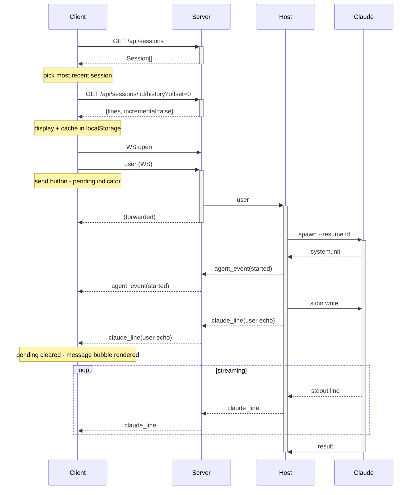
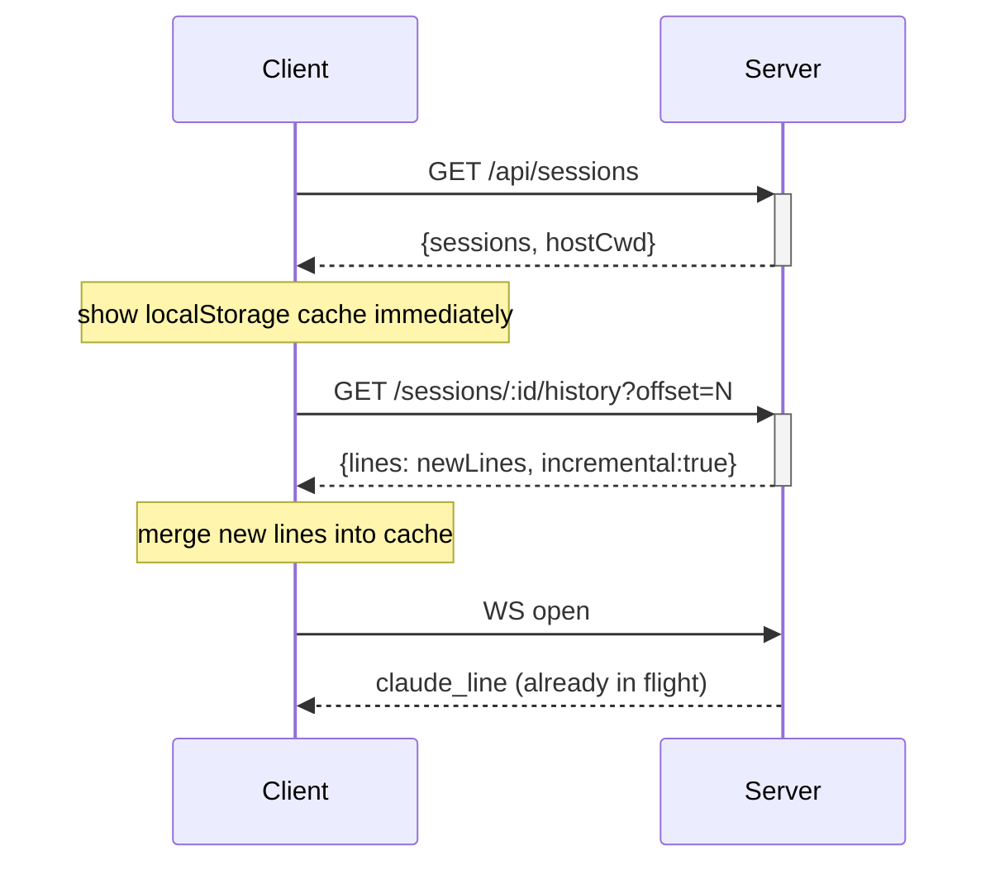
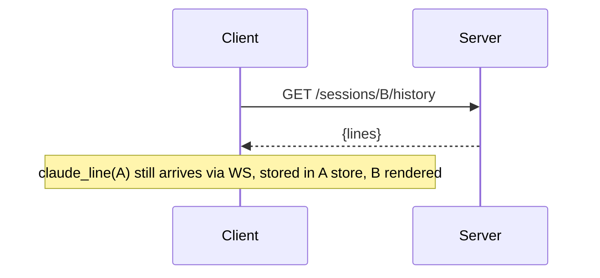
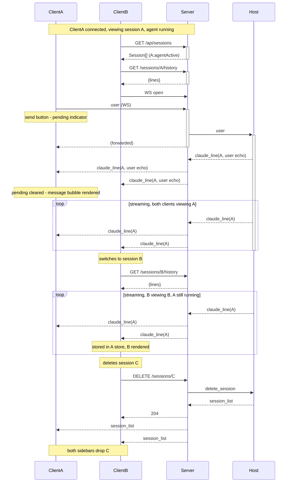
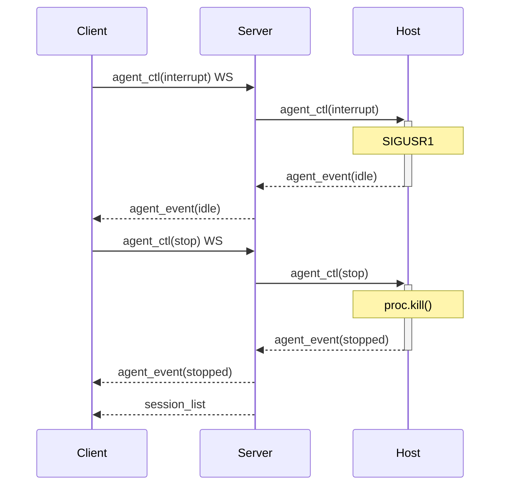

# Protocol Specification

Three-layer protocol. REST for stateless reads/writes, WebSocket for push events and
the stateful host stdin pipe.

```
Claude process  ←stdin/stdout→  Host  ←/host WS→  Server  ←REST+WS→  Clients
```

**Convention:** message fields invented by this app (not part of Claude CLI/Code) are prefixed
`claudeweb_` (e.g. `claudeweb_settings`).

---

## Layer 1 — Claude ↔ Host (stream-json stdio)

Standard Claude CLI stream-json protocol. Full event reference with examples: [`doc/claude-jsonl.md`](doc/claude-jsonl.md). Host spawns claude with:
```
claude --dangerously-skip-permissions \
       --input-format stream-json \
       --output-format stream-json \
       --include-partial-messages \
       --verbose \
       [--resume <sessionId>]
```

### Claude → Host (stdout)

| type | key fields | notes |
|------|-----------|-------|
| `system`    | `subtype:"init"`, `session_id`, `cwd` | first event |
| `assistant` | `message.{id,content}` | streamed; `text` and `tool_use` blocks |
| `tool`      | `message.content[]` (tool_result items) | host forwards to server |
| `user`      | `message.content: ToolResultBlock[]` | tool results only; **initial user message is NOT emitted on stdout** (session file only) |
| `result`    | `subtype`, `total_cost_usd`, `usage` | end of turn |

### Host → Claude (stdin)

| type | key fields |
|------|-----------|
| `user` | `role:"user"`, `content: string` |

---

## Layer 2 — Host ↔ Server (WebSocket `/host?key=HOST_KEY`)

One persistent connection. Host reconnects on drop.

### Host → Server

| type | key fields | notes |
|------|-----------|-------|
| `log` | `level`, `msg`, `data?`, `ts` | server buffers last 500 |
| `claude_line` | `sessionId`, `line` | every stdout line; server broadcasts to all WS clients |
| `agent_event` | `sessionId`, `event` | state transition; server broadcasts and updates agent map |
| `session_list` | `sessions: Session[]`, `hostCwd: string` | response to `list_sessions`; server caches and returns via REST |

**`agent_event` values:** `started` · `streaming` · `idle` · `stopped`

**Session object:**
```json
{ "id": "string", "title": "string", "ts": 1234567890123,
  "msgCount": 12, "cwd": "/path", "agentState": "running"|"idle"|null }
```
`agentState` is added by the server's `enrichSessions()` from the `agents` map; `null` means no agent running.

### Server → Host

| type | key fields | notes |
|------|-----------|-------|
| `list_sessions` | — | on host connect; response populates server's session cache |
| `new_session` | `cwd?: string`, `firstMessage?: string` | spawn fresh claude; if `firstMessage` provided, written to stdin immediately to trigger `system.init` |
| `delete_session` | `sessionId` | delete `.jsonl` file; host sends updated `session_list` |
| `agent_ctl` | `sessionId`, `event: 'stop'\|'interrupt'` | `stop`: kill process · `interrupt`: SIGUSR1 |
| `user` | `sessionId`, `message: {role, content}` | forward to claude stdin; host auto-resumes if no agent running |

---

## Layer 3 — Server ↔ Client

### REST API

JWT in `Authorization: Bearer <token>` header (obtained from `POST /api/login`).

| method | path | body / query | response | notes |
|--------|------|------|----------|-------|
| `POST` | `/api/login` | `{username, password}` | `{token}` | no auth |
| `GET` | `/api/sessions` | — | `{sessions: Session[], hostCwd: string}` | list all sessions; `hostCwd` is host's `process.cwd()` |
| `GET` | `/api/sessions/:id/history` | `?offset=N` | `{lines: string[], incremental: bool}` | raw JSONL lines; `offset` = line count client already has; host returns `raw.slice(offset)` |
| `POST` | `/api/sessions` | `{cwd?: string, firstMessage?: string}` | 202 | create session; `firstMessage` bootstraps `system.init`; client auto-switches on `agent_event: started` |
| `DELETE` | `/api/sessions/:id` | — | 204 | broadcasts new `session_list` from host  over WS |
| `GET` | `/api/logs` | `?fmt=text` | JSON array or plain text | `x-host-key` auth |
| `POST` | `/api/relay/chat` | `{messages[]}` | SSE stream | `x-relay-key` auth |
| `GET` | `/*` | — | `index.html` | SPA fallback |

### WebSocket `/ws?token=JWT`

Push events and stateful commands only.

**Server → Client (all broadcast)**

| type | key fields | notes |
|------|-----------|-------|
| `session_list` | `sessions: Session[]` | any session change; `hostCwd` is REST-only |
| `claude_line` | `sessionId`, `line` | clients route to per-session message store |
| `agent_event` | `sessionId`, `event` | clients update `agentActive` |
| `host_status` | `connected: bool` | host connect/disconnect |

**Client → Server**

| type | key fields | notes |
|------|-----------|-------|
| `agent_ctl` | `sessionId`, `event: 'stop'\|'interrupt'` | forwarded to host |
| `user` | `sessionId`, `message: {role, content}` | server forwards to host stdin; **host** echoes back as `claude_line({type:'user'})` to all clients |

---

## Implementation Notes

**User message echo (host):** The server does not echo user messages — it forwards them to the host, which emits a `claude_line({type:'user'})` after writing to Claude's stdin. This ensures the echo confirms delivery to the agent. On the sending client, the send button switches to a progress indicator immediately on send; it clears and the message bubble renders only when the echo `claude_line` arrives. Other clients receive the same `claude_line` broadcast and render the bubble identically.

**History relay (server):** `GET /api/sessions/:id/history?offset=N` parks the HTTP response in
`pendingHistoryHttp: Map<sessionId, entry[]>` and sends `get_session_history { sessionId, offset }` to host over WS.
Host replies `history { sessionId, lines }` with `raw.slice(offset)`. Server drains the map and sends HTTP response.
Multiple concurrent requests for the same sessionId coalesce into one WS request to host.

**Client history cache:** `localStorage` stores `{ lines: string[], lineCount: number }` per session.
On load: display cache immediately, then always fetch `?offset=lineCount` for incremental update.
If response is empty (`incremental: true, lines: []`), cache was fresh — no re-render.
`saveCurrentCache()` called on session switch and `beforeunload` — no clock dependency.

**New session flow:** clicking "+ new" switches client to local `__new__` state (no network call).
First message send POSTs `{ cwd, firstMessage }` to `/api/sessions` with `awaitingNewSession = true` set
before the fetch. Host spawns claude and writes `firstMessage` to stdin immediately, triggering `system.init`.
On `system.init`, host injects a synthetic session entry into the `session_list` broadcast (file may not exist yet).
Client auto-switches on the next `agent_event: started` for a non-current session.
After `result`, host calls `sendSessionList()` again with real file data (title, msgCount, cwd).

**504 resilience:** `pendingHistoryHttp` entries store `{ res, incremental, offset }`.
On host reconnect, server immediately re-sends `get_session_history` for all parked requests,
preventing them from timing out after 30 s.

**Delete confirmation:** server only resolves pending `DELETE /api/sessions/:id` responses when
the session id is absent from the host's next `session_list` broadcast.

**Client in-memory cache:** `sessionData: Map<sessionId, string[]>` stores raw JSONL lines for
background sessions. On session switch, `currentLines` (raw lines) is saved into `sessionData`
before switching; on switch-back lines are replayed through `parseLine`. Background `claude_line`
events push directly into `sessionData` — no parsed-object mixing.

---

## Server Internal State

```
hostWs: WebSocket | null
agents: Map<sessionId, { active: bool, streaming: bool }>  // from agent_events
sessionCache: Session[]                                     // from last session_list
logBuffer: Entry[]                                         // capped at 500
```

---

## Lifecycle Sequences

### Cold start — no agents running


### Hot start — agent running, client reconnects


### Session switch


### Two clients — one session active, one joining


### Interrupt then stop

